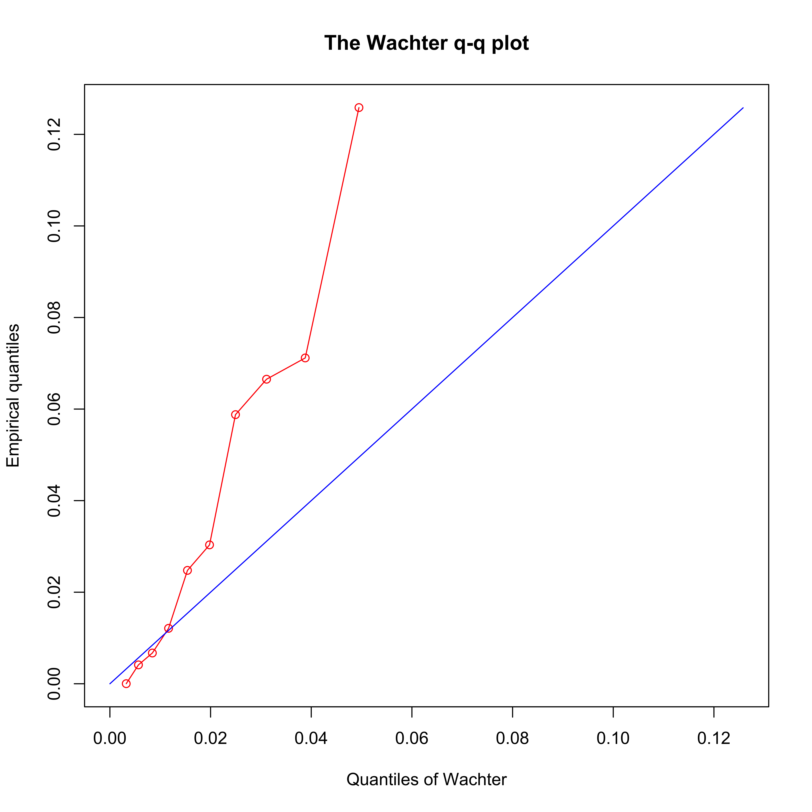

[](http://quantlet.de/)

## [](http://quantlet.de/) **CryptoDynamics_Wachter** [](http://quantlet.de/)

```yaml

Name of QuantLet : CryptoDynamics_Wachter

Published in : 'On Cointegration and Cryptocurrency Dynamics'

Description : 'Determines the cointegration rank with a Wachter QQ plot.'

Keywords : Cryptocurrencies, CRIX, Cointegration, QQ Plot

See also : 'CryptoDynamics_Series, Crypto_Dynamics_Estimation, CryptoDynamics_Scraping'

Author : Georg Keilbar, Yanfen Zhang

Submitted : October 5 2019 by Georg Keilbar

```



### R Code
```r

rm(list=ls())
library("tsDyn")
library("tseries")
library("xtable")
library("lattice")
library("igraph")


###############################
# Set directory and load data #
###############################

setwd("~/Dropbox/Cointegration and CC Dynamics/New Code")
source("wachterplot1009.R")
data = read.csv("logprice.csv",header=T)
date = as.Date(read.csv("logprice.csv")[,2])

#Transform to weekly data
logprice_weekly <- matrix(0, nrow(data)/7,10)
for (i in 1:nrow(logprice_weekly))
{
  logprice_weekly[i,] <-apply(as.matrix(data[(7 * (i - 1) + 1):(7 * i),3:12]),2,mean)
}


#########################
# Test for stationarity #
#########################

#Select whether you want to use daily or weekly data

#daily data:
logprice = as.matrix(data[,-c(1,2)]) # X_t
#weekly data:
#logprice = logprice_weekly[,-(7:10)]

T = nrow(logprice)
p = ncol(logprice)
dlogprice = logprice[-1,]-logprice[-T,] # Delta_X_t

#ADF Test for level and first differences
for (i in 1:p){
  print(adf.test(logprice[,i]))
}

for (i in 1:p){
  print(adf.test(dlogprice[,i]))
}

#KPSS Test for level and first differences
for (i in 1:p){
  print(kpss.test(logprice[,i]))
}
for (i in 1:p){
  print(kpss.test(dlogprice[,i]))
}


####################
# Wachter Q-Q plot #
####################

R_0t <- t(dlogprice)
R_1t <- t(logprice[-T,])

S_00 <- R_0t %*% t(R_0t)/(T-1)
S_01 <- R_0t %*% t(R_1t)/(T-1)
S_11 <- R_1t %*% t(R_1t)/(T-1)

E<-eigen(solve(S_11)%*%t(S_01)%*%solve(S_00)%*%S_01)

lambda = E$values

wachterplot(lambda,T-1)
r = 4
```

automatically created on 2020-03-24